# GIGATT Geomapper — Full Build Plan

**Purpose:** Step-by-step plan for the role-based, authenticated driver-tracking + permit-aware dispatch platform. Follow this document in order to avoid mistakes. Do not skip sections or invert the build order unless explicitly noted.

**Document version:** 2.2  
**Last updated:** 2026-03-15

Related docs (setup, deploy, baseline, migration, driver app) are indexed in [README.md](README.md#documentation-index).

**As built (Phases 1–7):** Backend: `server.py` + Supabase; local file storage for ingestion (`data/uploads/`). APIs: auth/config, jobs (CRUD, assign, candidate-drivers, list with optional `near_lat`/`near_lng`/`min_mi`/`max_mi`), drivers, ingestion-documents (upload, parse), permit-candidates (list, PATCH, approve, reject, create-job), driver-locations batch (JWT optional). Frontend: dispatch UI (incoming permits, jobs near driver, unassigned jobs, drivers, assign flow); driver portal (assignment card, location batching, offline queue); admin UI (user/role/state/config management); login/role routing. DB: profiles, driver_profiles, jobs (with origin_lat/origin_lng per migration 003), job_route_states, driver_state_permissions, location_history, driver_last_location, ingestion_documents, permit_candidates, dispatch_config. Assignment is implemented via `jobs.assigned_driver_id` (no separate driver_assignments table). Unbuilt or partial: driver_availability calendar API, full realtime.

---

## Visual Overview

Use this section as a quick map before reading the full plan:

- `Wiring Graph`: overall platform handshake between driver app, dispatcher UI, admin, backend, auth, storage, ingestion, and jobs.
- `Systems Graph`: ownership boundaries between frontend surfaces, platform modules, backend authority, and persistent data/services.
- `Role-Aware Login Routing Sequence`: how login resolves role and routes users to `/driver`, `/dispatch`, or admin surfaces.
- `Dispatcher Assignment Sequence`: how dispatch chooses and assigns a driver to a job.
- `Permit Ingestion Review And Job Creation Flow`: how raw intake becomes `ingestion_document`, then `permit_candidate`, then reviewed `job`.
- `Driver Location Sync Sequence`: offline queue, batch upload, dedupe, persistence, and dispatcher freshness updates.
- `Frontend Surface Data-Source Graph`: which frontend surfaces depend on which backend providers.
- `Current Vs Target Architecture Graph`: what stays, what gets extended, and what is replaced during the migration.
- `Permit Lifecycle State Graph`: the lifecycle from raw intake through review to assignable job states.
- `Driver Availability And Assignment Ranking Graph`: how availability, status, freshness, and distance affect assignment decisions.
- `Left Vs Right Sidebar Focus Interaction Graph`: how `market_route` and `driver_assignment` focus modes coexist without breaking the shared map.
- `Auth And Authorization Enforcement Graph`: where backend permission checks must happen after login.
- `Parallel Transition Migration Graph`: how the existing market/opportunity path coexists with the new dispatch path.
- `Core Entity Relationship Graph`: the major data entities and how they relate.

### Wiring Graph

*Built through Phase 7: Driver app, Dispatch UI, Backend API, Auth, DB, local uploads, ingestion pipeline, jobs (including jobs-near-driver filter), Admin UI and API. Availability/calendar and existing market flow remain unbuilt or partial.*

*In diagrams below: **built** = green fill; **unbuilt** = gray fill.*

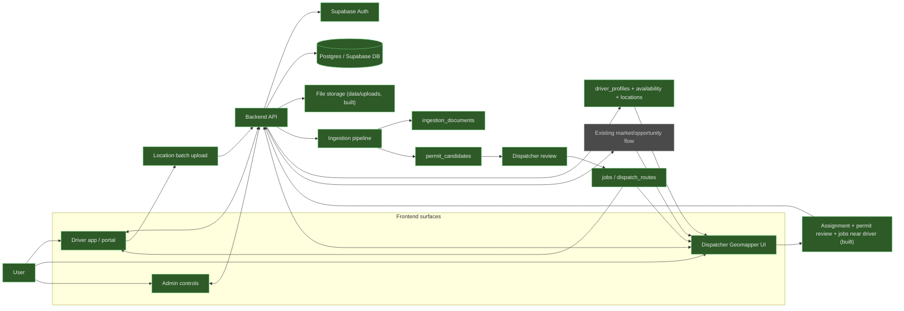

### Systems Graph

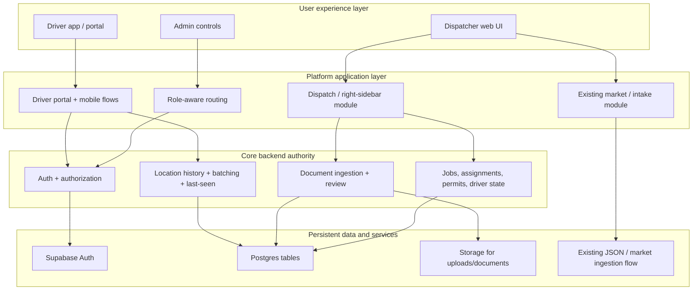

### Role-Aware Login Routing Sequence

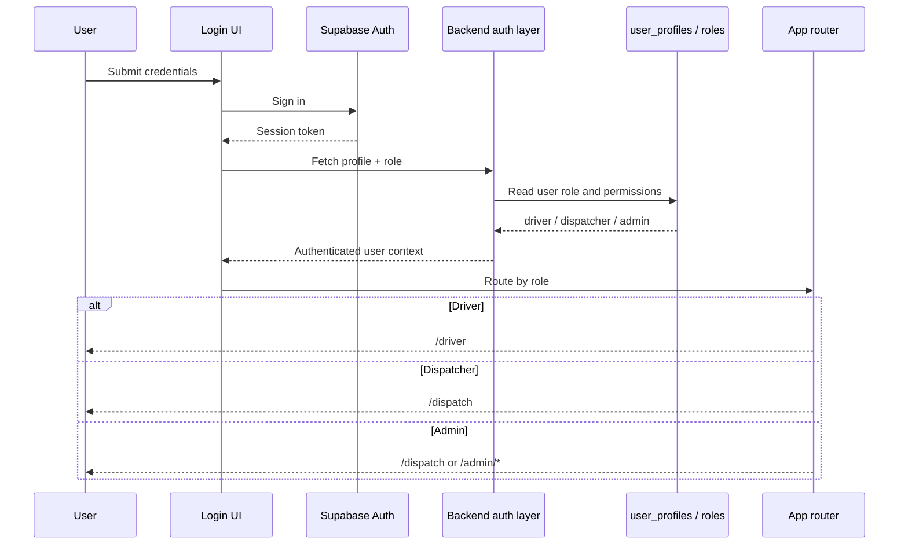

### Dispatcher Assignment Sequence

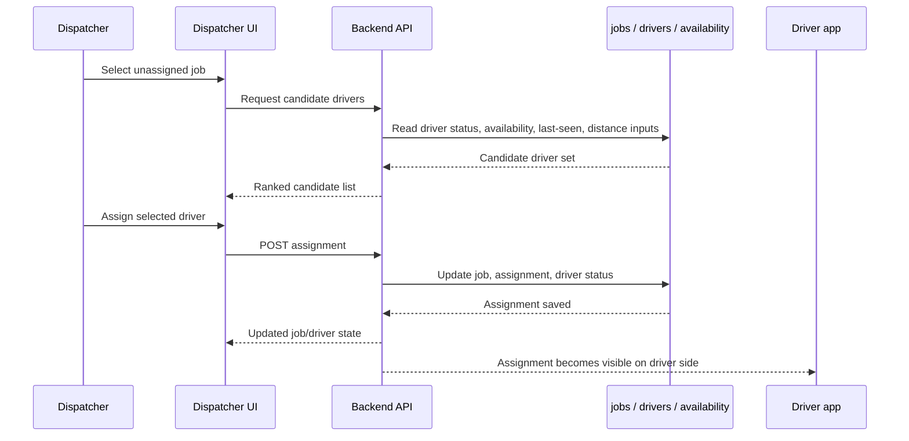

### Permit Ingestion Review And Job Creation Flow

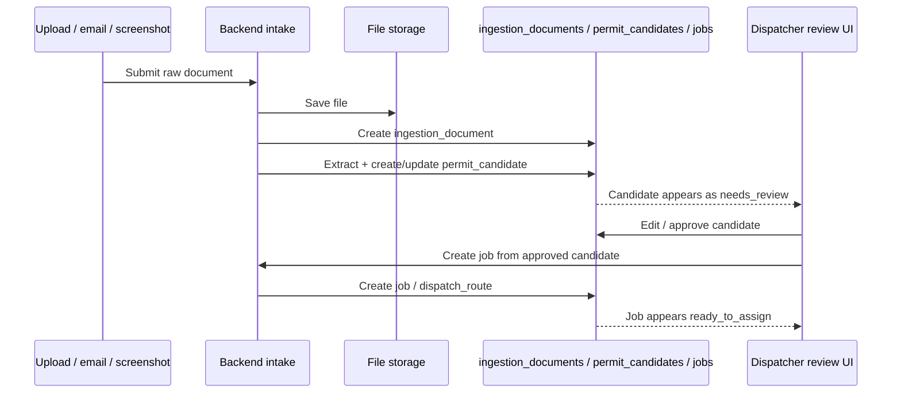

### Driver Location Sync Sequence

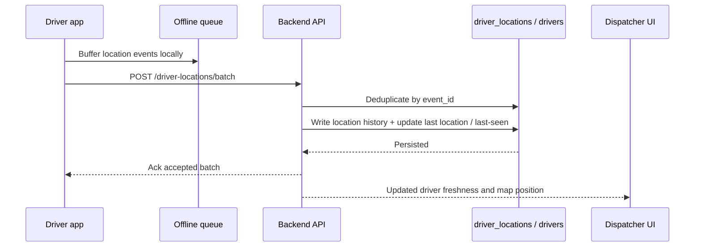

### Frontend Surface Data-Source Graph

*Built: DriverPortal → batch location + Supabase (profile, assigned job). DispatchUI → GET/POST/PATCH jobs, candidate-drivers, assign, GET jobs?near_lat/near_lng/min_mi/max_mi, ingestion-documents upload/parse, permit-candidates list/PATCH/approve/reject/create-job, drivers, LegacyFeed. Login → Auth. AdminUI and AdminAPI (users, roles, state permissions, config) are built. Availability calendar and market flow remain unbuilt or partial.*

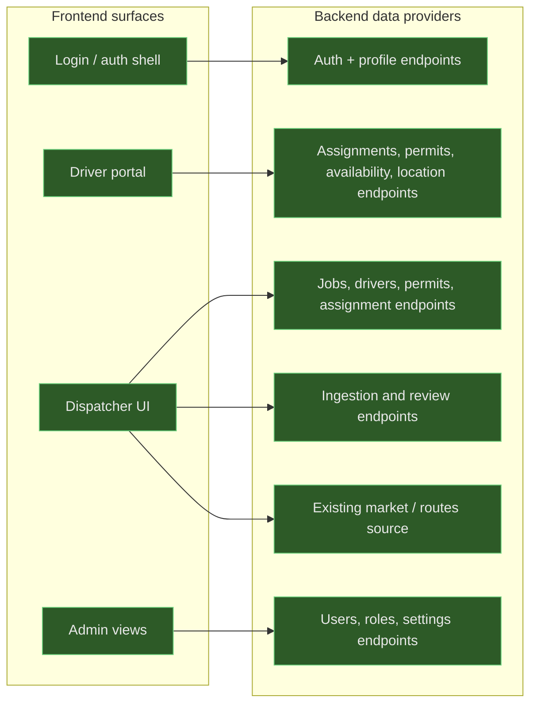

### Current Vs Target Architecture Graph

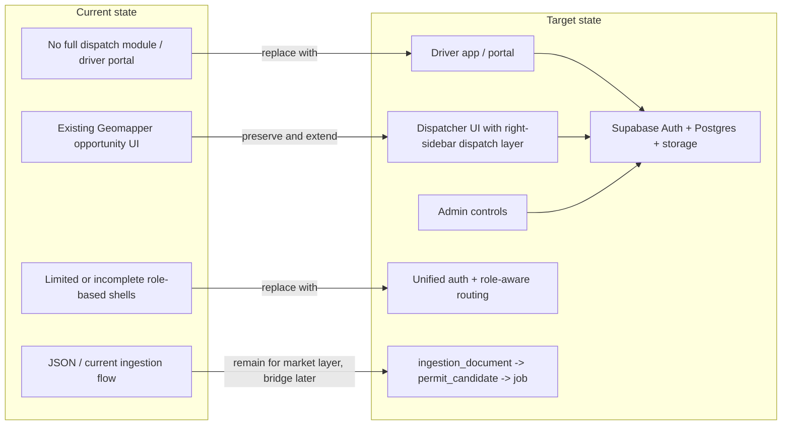

### Permit Lifecycle State Graph

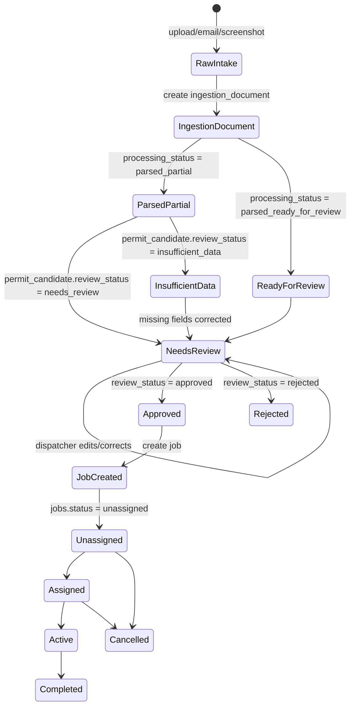

### Driver Availability And Assignment Ranking Graph

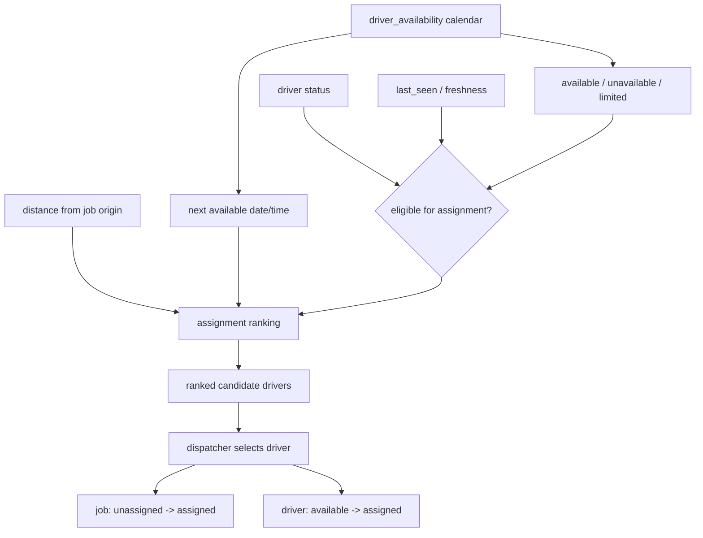

### Left Vs Right Sidebar Focus Interaction Graph

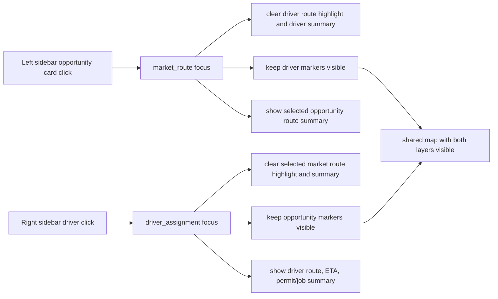

### Auth And Authorization Enforcement Graph

```mermaid
flowchart TD
    Login[User login] --> Supabase[Supabase Auth]
    Supabase --> Session[session token]
    Session --> Profile[user profile + role]

    Profile --> DriverRole[Driver]
    Profile --> DispatcherRole[Dispatcher]
    Profile --> AdminRole[Admin]

    DriverRole --> DriverRoutes[/driver routes]
    DispatcherRole --> DispatchRoutes[/dispatch routes]
    AdminRole --> AdminRoutes[/admin routes]

    DriverRoutes --> DriverAPI[driver-safe APIs only]
    DispatchRoutes --> DispatchAPI[dispatcher APIs]
    AdminRoutes --> AdminAPI[admin APIs]

    DriverAPI --> Authz[backend authorization check]
    DispatchAPI --> Authz
    AdminAPI --> Authz

    Authz --> Allow[allow request]
    Authz --> Deny[deny request]
```

### Parallel Transition Migration Graph

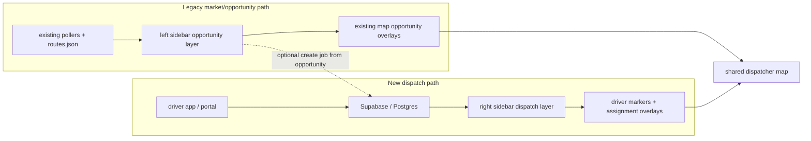

### Core Entity Relationship Graph

*As built: Assignment is implemented via jobs.assigned_driver_id (no separate driver_assignments table). JOBS include origin_lat, origin_lng (migration 003). DRIVER_LOCATIONS realized as location_history + driver_last_location. DRIVER_AVAILABILITY and DRIVER_ASSIGNMENTS (logical) remain for future or reference.*

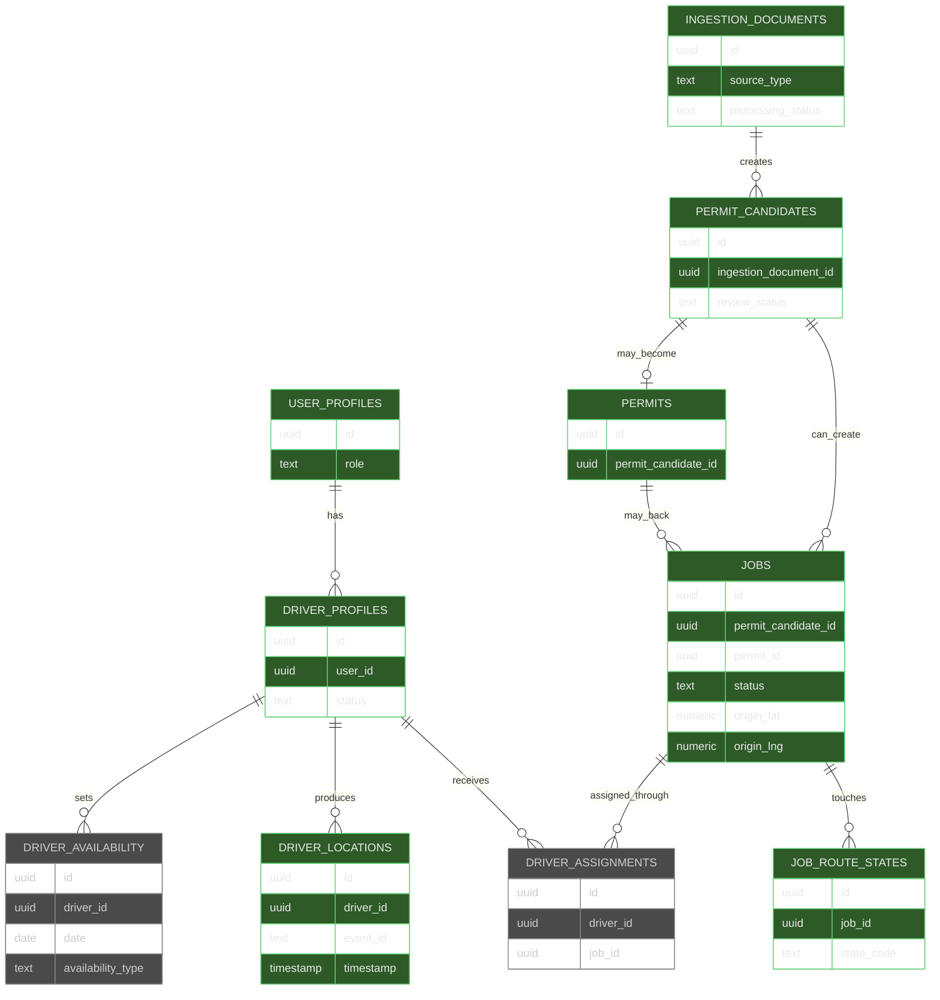

### Data Ownership Graph

```mermaid
flowchart TD
    DriverApp[Driver app] -->|writes| DriverAvailability[driver_availability]
    DriverApp -->|writes| LocationHistory[location_history / driver_locations]
    DriverApp -->|may trigger| DriverStatus[driver status transitions]

    DispatcherUI[Dispatcher UI] -->|writes| PermitReview[permit_candidate review + edits]
    DispatcherUI -->|writes| Jobs[jobs / dispatch_routes]
    DispatcherUI -->|writes| Assignments[driver_assignments]
    DispatcherUI -->|writes| DriverStatus

    AdminUI[Admin UI] -->|writes| Users[user profiles / roles]
    AdminUI -->|writes| Settings[business rules / config]

    Backend[Backend services] -->|writes| IngestionDocs[ingestion_documents]
    Backend -->|writes| PermitCandidates[permit_candidates]
    Backend -->|writes| LastSeen[last_seen / heartbeat / last_location]
    Backend -->|derives| ProjectedFields[projected_available_at / projected_completion / projected_available_location]

    Pollers[Existing market pollers] -->|write| MarketJSON[current market / routes JSON]
```

### Derived State And Computed Fields Graph

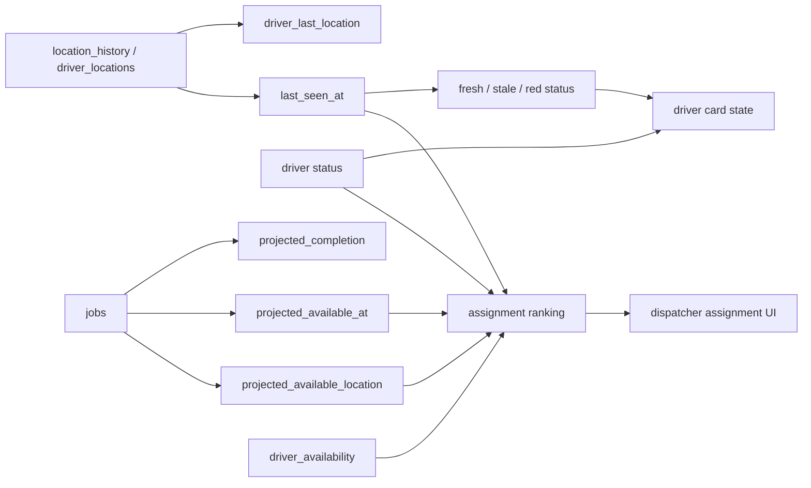

### Driver Status State Machine

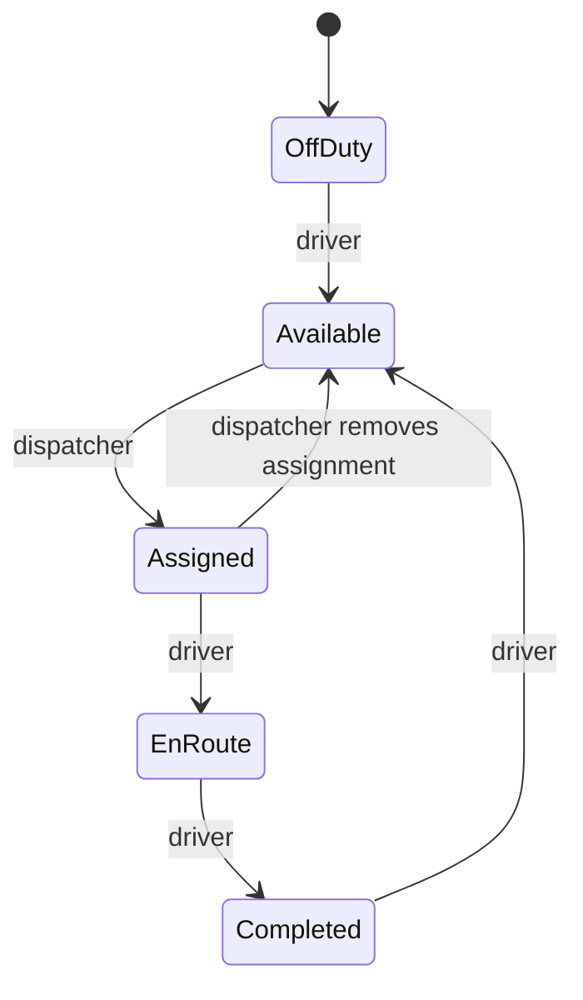

### Job Status State Machine

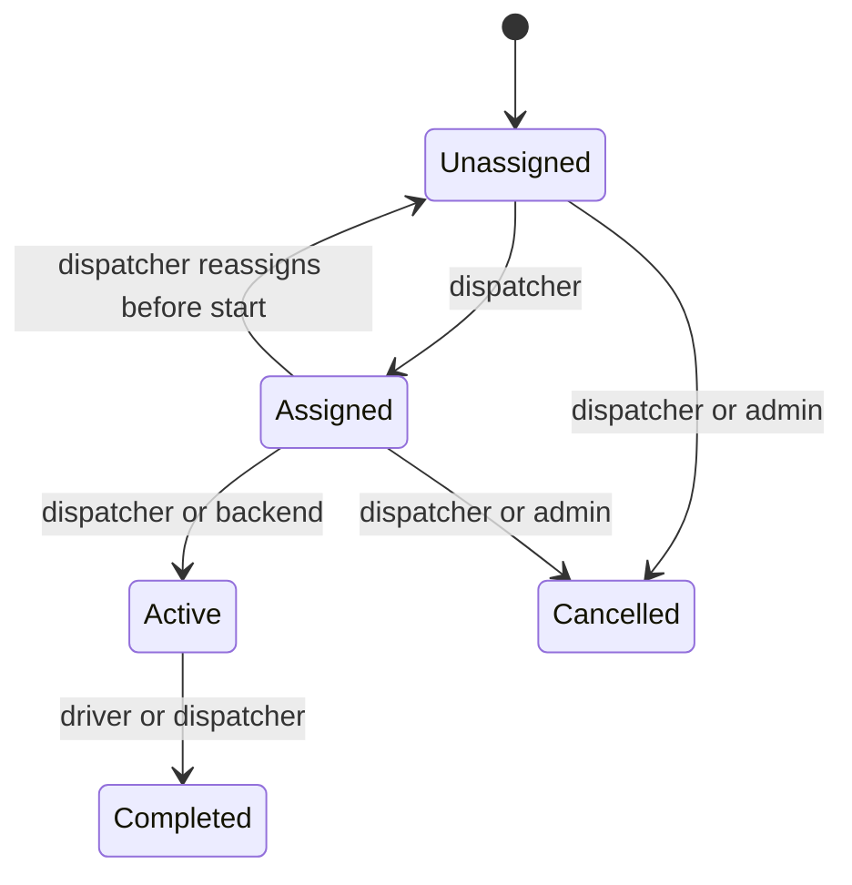

### Ingestion Processing State Machine

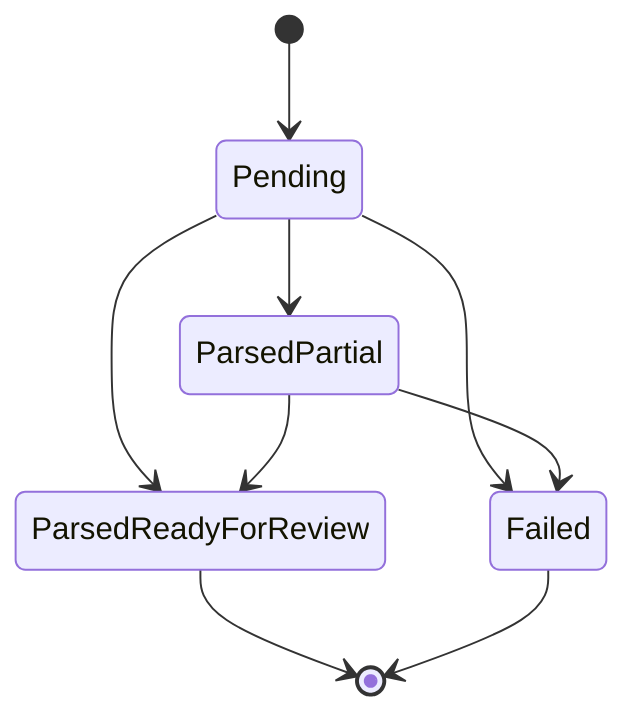

### Permit Candidate Review State Machine

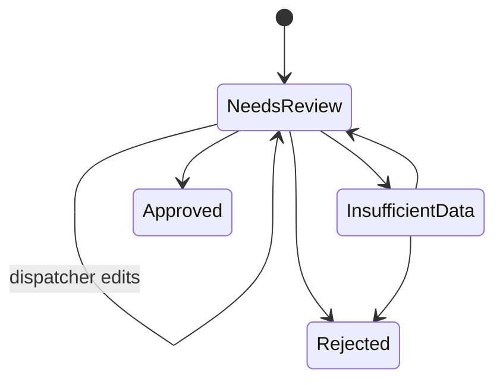

### API To Entity Effect Graph

*Built: Upload, Parse, CreateJob, Assign (POST /api/jobs/:id/assign → jobs + driver_profiles; no separate driver_assignments table), BatchLoc, Auth. Permit review implemented as PATCH /api/permit-candidates/:id + POST .../approve + POST .../reject. GET /api/jobs with near_lat, near_lng, min_mi, max_mi reads jobs (origin_lat/lng). Availability and some admin endpoints remain unbuilt.*

```mermaid
flowchart TD
    classDef built fill:#2d5a27,stroke:#6bcf7c,color:#e8e8e8
    classDef unbuilt fill:#4a4a4a,stroke:#888,color:#ccc

    Upload[POST /api/ingestion-documents] --> IngestionDocs[ingestion_documents]
    Parse[POST /api/ingestion-documents/:id/parse] --> PermitCandidates[permit_candidates]
    ApproveReject["PATCH /api/permit-candidates/:id, POST .../approve, .../reject (built)"] --> PermitCandidates
    CreateJob[POST /api/permit-candidates/:id/create-job] --> Jobs[jobs]
    Assign[POST /api/jobs/:id/assign] --> Jobs
    Assign --> DriverProfiles[driver_profiles]
    JobsNear[GET /api/jobs?near_lat/near_lng/min_mi/max_mi] --> Jobs
    BatchLoc[POST /api/driver-locations/batch] --> LocationHistory[location_history]
    BatchLoc --> LastLocation[driver_last_location / last_seen]
    Availability[PUT /api/drivers/:id/availability] --> DriverAvailability[driver_availability]
    AuthEndpoints[login / session / profile] --> UserProfiles[user_profiles / roles]

    class Upload,Parse,ApproveReject,CreateJob,Assign,JobsNear,BatchLoc,AuthEndpoints,IngestionDocs,PermitCandidates,Jobs,DriverProfiles,LocationHistory,LastLocation,UserProfiles built
    class Availability,DriverAvailability unbuilt
```

### Exact SQL-Level Relation Graph

```mermaid
erDiagram
    AUTH_USERS ||--|| PROFILES : "profiles.id -> auth.users.id"
    AUTH_USERS ||--o| DRIVER_PROFILES : "driver_profiles.user_id -> auth.users.id"
    AUTH_USERS ||--o| DISPATCHER_PROFILES : "dispatcher_profiles.user_id -> auth.users.id"
    AUTH_USERS ||--o{ INGESTION_DOCUMENTS : "uploaded_by -> auth.users.id"

    DRIVER_PROFILES ||--|| DRIVER_LAST_LOCATION : "driver_last_location.driver_id"
    DRIVER_PROFILES ||--o{ LOCATION_HISTORY : "location_history.driver_id"
    DRIVER_PROFILES ||--o{ DRIVER_AVAILABILITY : "driver_availability.driver_id"
    DRIVER_PROFILES ||--o{ DRIVER_STATE_PERMISSIONS : "driver_state_permissions.driver_id"
    DRIVER_PROFILES ||--o{ DEVICES : "devices.driver_id"
    DRIVER_PROFILES ||--o{ JOBS : "jobs.assigned_driver_id"

    INGESTION_DOCUMENTS ||--o{ PERMIT_CANDIDATES : "permit_candidates.ingestion_document_id"
    PERMIT_CANDIDATES ||--o{ PERMITS : "permits.permit_candidate_id"
    PERMIT_CANDIDATES ||--o{ JOBS : "jobs.permit_candidate_id"
    PERMITS ||--o{ JOBS : "jobs.permit_id"
    JOBS ||--o{ JOB_ROUTE_STATES : "job_route_states.job_id"

    PROFILES {
      uuid id PK
      text email
      text role
      boolean active
    }
    DRIVER_PROFILES {
      uuid id PK
      uuid user_id FK
      text status
      timestamptz last_seen_at
      timestamptz last_location_at
      timestamptz last_status_at
    }
    DISPATCHER_PROFILES {
      uuid id PK
      uuid user_id FK
    }
    DRIVER_LAST_LOCATION {
      uuid driver_id PK, FK
      float lat
      float lng
      timestamptz timestamp
    }
    LOCATION_HISTORY {
      uuid id PK
      uuid driver_id FK
      text event_id
      timestamptz timestamp
    }
    DRIVER_AVAILABILITY {
      uuid id PK
      uuid driver_id FK
      date date
      availability_type availability_type
    }
    DRIVER_STATE_PERMISSIONS {
      uuid id PK
      uuid driver_id FK
      char state_code
      boolean allowed
    }
    INGESTION_DOCUMENTS {
      uuid id PK
      source_type source_type
      uuid uploaded_by FK
      processing_status processing_status
    }
    PERMIT_CANDIDATES {
      uuid id PK
      uuid ingestion_document_id FK
      review_status review_status
      integer estimated_duration_minutes
    }
    PERMITS {
      uuid id PK
      uuid permit_candidate_id FK
    }
    JOBS {
      uuid id PK
      uuid permit_id FK
      uuid permit_candidate_id FK
      uuid assigned_driver_id FK
      job_status status
      timestamptz projected_completion
      timestamptz projected_available_at
      jsonb projected_available_location
    }
    JOB_ROUTE_STATES {
      uuid id PK
      uuid job_id FK
      char state_code
    }
    DEVICES {
      uuid id PK
      uuid driver_id FK
      text device_id
    }
    DISPATCH_CONFIG {
      text key PK
      jsonb value
    }
```

### RLS And Permission Graph

```mermaid
flowchart TD
    User[Authenticated user] --> Role{role from profiles}
    Role --> Driver[driver]
    Role --> Dispatcher[dispatcher]
    Role --> Admin[admin]

    Driver --> OwnProfile[read own profiles row]
    Driver --> OwnDriverProfile[select/insert/update own driver_profile]
    Driver --> OwnLocations[insert/select own location_history]
    Driver --> OwnAvailability[manage own driver_availability]
    Driver --> OwnJob[read own assigned jobs]

    Dispatcher --> ReadDriverProfiles[read all driver_profiles]
    Dispatcher --> ReadLocations[read driver_last_location and location_history]
    Dispatcher --> ReadAvailability[read driver_availability]
    Dispatcher --> ManageJobs[full access jobs]
    Dispatcher --> ManageCandidates[full access permit_candidates]
    Dispatcher --> ManageIngestion[full access ingestion_documents]
    Dispatcher --> ReadConfig[read dispatch_config]

    Admin --> ReadDriverProfiles
    Admin --> ReadLocations
    Admin --> ReadAvailability
    Admin --> ManageJobs
    Admin --> ManageCandidates
    Admin --> ManageIngestion
    Admin --> ReadConfig
    Admin --> InsertDriverProfile[admin insert driver_profile]

    Deny[all other access denied by RLS default]
    Driver --> Deny
    Dispatcher --> Deny
    Admin --> Deny
```

### Projected Availability And Ranking Derivation Graph

```mermaid
flowchart LR
    JobStatus[jobs.status] --> ActiveJob{job active or assigned?}
    ScheduledStart[jobs.scheduled_start] --> ETA[projected_completion]
    EstDuration[jobs.estimated_duration] --> ETA
    PermitDuration[permit_candidates.estimated_duration_minutes] --> ETA
    RouteEnd[origin/destination/route outcome] --> AvailLoc[projected_available_location]

    ETA --> Cutoff{after dispatch_day_cutoff_time?}
    Cutoff -->|no| ProjectedAvail[projected_available_at = projected_completion + availability_buffer_minutes]
    Cutoff -->|yes| NextDay[projected_available_at = next day start + buffer]

    Config1[dispatch_config.dispatch_day_cutoff_time] --> Cutoff
    Config2[dispatch_config.dispatch_next_day_start_time] --> NextDay
    Config3[dispatch_config.availability_buffer_minutes] --> ProjectedAvail
    Config3 --> NextDay

    DriverAvail[driver_availability for target date] --> Eligibility[assignment eligibility]
    DriverStatus[driver_profiles.status] --> Eligibility
    LastSeen[last_seen_at / freshness] --> Eligibility
    LastLoc[driver_last_location] --> Distance[distance from job origin]
    ProjectedAvail --> Eligibility
    AvailLoc --> Distance

    Eligibility --> Ranking[assignment ranking score]
    Distance --> Ranking
    Ranking --> RankedDrivers[dispatcher candidate list]
```

---

## Architecture Statement

**GIGATT Geomapper platform** is a single authenticated platform with role-based experiences:

- **Driver app/portal** — Assignment view, permits, navigation, availability calendar (not the dispatcher map).
- **Dispatcher Geomapper UI** — Market + dispatch operations (existing left sidebar + right sidebar dispatch layer).
- **Admin controls** — User and system management (dispatcher view plus elevated tools).

Auth and role-based routing are **core architecture**, not an afterthought. Login defines what data each user sees, what page they land on, what actions they can take, and what APIs they can call. Backend authorization must enforce access — frontend-only role protection is insufficient.

---

## Table of Contents

1. [Overview & Principles](#1-overview--principles)
2. [Role Model & Post-Login Routing](#2-role-model--post-login-routing)
3. [What Must Not Be Broken](#3-what-must-not-be-broken)
4. [System Architecture](#4-system-architecture)
5. [Driver Portal (Driver View)](#5-driver-portal-driver-view)
6. [Dispatcher UI (Left vs Right)](#6-dispatcher-ui-left-vs-right)
7. [Driver Availability Model](#7-driver-availability-model)
8. [V1 Mandatory Requirements](#8-v1-mandatory-requirements)
9. [Data Model Reference](#9-data-model-reference)
10. [Permit & Dispatch Layer (Right Sidebar)](#10-permit--dispatch-layer-right-sidebar)
11. [Phased Build Order (Step-by-Step)](#11-phased-build-order-step-by-step)
12. [Driver Experience (Install & Use)](#12-driver-experience-install--use)
13. [Auth, Security, Testing & Staging](#13-auth-security-testing--staging)
14. [What to Avoid](#14-what-to-avoid)
15. [V2+ (Explicitly Later)](#15-v2-explicitly-later)
16. [Execution Rules for AI Agent](#16-execution-rules-for-ai-agent)

---

## 1. Overview & Principles

### 1.1 What we are building

- **Shared backend:** One backend handles auth, users, roles, drivers, assignments, permits, availability, location, jobs, and ingestion/review. Supabase Auth + Postgres.
- **Shared login:** One auth system. Different post-login shells based on role.
- **Driver app/portal (Capacitor):** iOS and Android. Drivers install via TestFlight (iOS) or link/APK (Android), sign in, grant location. They land in a **driver portal**, not the dispatcher map. Portal shows: current assignment, permits, navigation link, availability calendar, profile.
- **Dispatcher web app (Geomapper):** Existing Geomapper. Dispatchers land here after login. Left sidebar (opportunity layer) + right sidebar (dispatch layer). Availability from driver calendar feeds into assignment flow and filters.
- **Admin:** Same dispatcher view plus admin tools (manage users, roles, settings, devices, business rules).

### 1.2 Core principles

- **Auth + role-aware routing + role-aware UI + role-aware authorization** — This is not “add login screen.” It is define who sees what, where they go, and enforce it on the backend.
- **Do not replace the current Geomapper.** Add the dispatch layer as a **second module** (right sidebar + new backend entities). Left sidebar and existing ingestion stay untouched.
- **Design for real field behavior:** Offline queue, batched location uploads, location history, driver/assignment status, heartbeat/last-seen, driver availability calendar, and a defined migration path from current JSON-based data.
- **One auth system** for driver app and Geomapper. One backend. Role-based post-login routing.

### 1.3 Important reality

- **Install flow:** Not “one web link and done.” Drivers install an app (TestFlight or link), then sign in and grant permissions. Background tracking is only reliable with proper native location handling (Capacitor + iOS/Android config).
- **Permit ingestion:** Permits are not fully standardized. Plan for best-effort parse + dispatcher review/correct. Do not assume universal full auto-parse on day one.

---

## 2. Role Model & Post-Login Routing

### 2.1 Role model

| Role | Can | Cannot |
|------|-----|--------|
| **Driver** | Log in; view own assignments; view own permits; view route/navigation links; update own availability calendar; post own location; maybe update assignment status if allowed | See other drivers; see dispatcher tools; assign jobs; edit permits globally; access other users' data |
| **Dispatcher** | See all drivers; see driver availability; see jobs; assign/reassign jobs; review permits if allowed; view map and dispatch tools | Change global admin settings unless granted; manage all auth/roles unless admin |
| **Admin** | Do all dispatcher actions; manage users/roles; manage configs; handle system-level controls | — |

**Backend authorization must enforce access.** Do not rely on frontend-only role protection (hiding buttons). Every API must validate the caller's role and permissions.

### 2.2 Post-login routing

After login, route the user by role:

| Role | Lands on |
|------|----------|
| **Driver** | Driver portal/app (`/driver`) — focused task page, NOT the dispatcher map |
| **Dispatcher** | Geomapper dispatcher UI (`/dispatch`) — left sidebar opportunity + right sidebar dispatch |
| **Admin** | Dispatcher view with extra admin tabs (`/dispatch` or `/admin/*`) — same map plus elevated controls |

### 2.3 Admin v1 scope

Admin v1 includes at least:

- Create / invite / deactivate users
- Assign roles (driver, dispatcher, admin)
- Manage driver-state permissions
- Manage availability / business-rule config
- View device / session records
- Force logout (optional)

Without a boundary, "admin" becomes an undefined bucket. V1 non-goals (Section 14.1) define what is explicitly out of scope.

### 2.4 Route structure (URLs)

| Type | Routes |
|------|--------|
| **Public** | `/login`, `/password-reset`, `/invite-accept` |
| **Driver (authenticated)** | `/driver`, `/driver/assignment/:id`, `/driver/availability`, `/driver/profile` |
| **Dispatcher (authenticated)** | `/dispatch`, `/dispatch/jobs/:id`, `/dispatch/drivers/:id`, `/dispatch/permits/:id` |
| **Admin (authenticated)** | `/admin/users`, `/admin/settings`, `/admin/devices` |

All can live in one project. Role check on route load: if driver visits `/dispatch`, redirect to `/driver`; if dispatcher visits `/driver`, redirect to `/dispatch`.

---

## 3. What Must Not Be Broken

Before changing any code, confirm these remain true.

| Rule | Meaning |
|------|--------|
| **Left sidebar** | Keeps all current Geomapper behavior: load board routes, email/broker/text ingestion, filters, zone, route cards, refresh. No merge with dispatch. |
| **Current ingestion** | Existing pollers, `routes.json`, and load discovery flow are **not** replaced. They remain the “market/opportunity” source. |
| **Current map behavior** | Opportunity markers, heatmap, zone circle, selected-route focus stay as-is. New behavior is added via **new overlays** (driver markers, assignment polylines), not by rewriting existing map logic. |
| **No single mixed list** | Opportunity cards (left) and driver/assignment cards (right) are never merged into one ambiguous list. |
| **Two focus modes** | Clicking a **route on the left** = `market_route` focus (existing behavior). Clicking a **driver on the right** = `driver_assignment` focus (zoom to driver + route, show permit/job summary). |

**If any step would violate the above, stop and redesign that step.**

---

## 4. System Architecture

### 4.1 Three pieces

| Piece | Tech | Responsibility |
|-------|------|----------------|
| **Driver app** | Capacitor (web UI in native shell), iOS + Android | Sign in, location permission, background location, send batched location updates, show current assignment and status. |
| **Backend** | Supabase Auth + Postgres, REST (realtime later) | Auth, users, roles, drivers, assignments, location history, permit jobs, idempotent batch ingestion, last-seen/heartbeat, availability computation. |
| **Dispatcher (Geomapper)** | Existing web app | Left: opportunity layer (unchanged). Right: driver list, assignments, permit/job details, ETA, availability. Center: shared map with both overlay layers. |

### 4.2 Data flow (minimal)

| From | To | What |
|------|-----|------|
| Driver app | Backend | Batched location events (with `event_id`), assignment status updates, availability calendar updates. |
| Backend | Geomapper | Drivers, last location, last-seen, assignments, permit jobs, availability. |
| Geomapper (dispatcher) | Backend | Assign job to driver, set driver status, (later) create job from permit. |

### 4.3 Module split (for implementation)

- **Module A — Market / intake:** Left sidebar + existing ingestion + opportunity routes. **Do not rewrite.**
- **Module B — Dispatch / driver:** Right sidebar + drivers + assignments + permit jobs + location history + availability. **Add as new code paths and overlays.**
- **Shared:** Map (both modules render separate layers), auth (one Supabase Auth for both).

---

## 5. Driver Portal (Driver View)

Drivers land here after login — a focused task page, **not** the dispatcher map. Do not dump drivers into the dispatcher UI.

### 5.1 Current assignment card

- Assignment status (assigned, en_route, completed).
- Route name / trip name.
- Origin and destination.
- Scheduled start.
- ETA / projected completion.
- Dispatcher contact.
- Special notes.

### 5.2 Permit documents

- Permit file links (view original).
- Permit summaries (cleaned, human-readable).
- Restrictions.
- Escort requirements.
- Validity dates.

Provide: "View original permit" and "View permit summary." Drivers see only permits tied to their assignment.

### 5.3 Navigation

- **Open route in Google Maps** — prefilled origin/destination link.
- **Warning:** "Navigation link is convenience only. Follow permit-approved route and restrictions." Google Maps may not represent legal permit routing for oversized/escort routes. This disclaimer must be shown.

### 5.4 Availability calendar

Drivers enter availability to feed dispatch planning. v1 structure:

- Monthly calendar.
- Per day: **available**, **unavailable**, or **limited**.
- Optional start/end availability window.
- Optional note (e.g. "doctor appt," "off after 2 PM").

Do not overbuild v1: no recurrence engines, PTO workflows, or approval chains. Later: `driver_availability_templates` for recurring patterns.

### 5.5 Profile / account

- Name, phone, email.
- Emergency or company contact (later).
- App/device/session info (later).

---

## 6. Dispatcher UI (Left vs Right)

### 6.1 Left sidebar (existing — do not alter for dispatch)

- Opportunity filters (time, route type, map locations).
- Load/route cards from current ingestion (email, load boards, broker texts, etc.).
- Zone filter, refresh, poll status.
- Route focus summary when a route card is selected.
- **Click route on left:** Existing behavior (focus route on map, show summary). Focus mode = `market_route`.

### 6.2 Right sidebar (new — dispatch only)

- Driver list with status (available, assigned, en_route, stale, off_duty).
- Per driver: current assigned route, origin/destination, ETA, miles left, time left, estimated availability, next available location.
- **Driver availability from calendar:** available today, unavailable, limited availability, next available date/time.
- Permit/job details when a driver with an assignment is selected.
- Actions: assign route, (later) create job from permit.
- **Click driver on right:** Center map on driver, highlight assigned route, show route line and origin/destination markers, show permit/job summary. Focus mode = `driver_assignment`.
- **Assignment flow:** When assigning a job, filter/sort available drivers by: driver status, projected availability, monthly availability calendar, distance from origin, freshness/last-seen.
- **Map/UI filters:** Dispatcher can filter: only available drivers, available this week, unavailable today, limited availability drivers.

### 6.3 Center map

- **Existing layers:** Opportunity markers, heatmap, zone circle, selected opportunity route.
- **New layers:** Driver markers, assigned-route polylines, driver position on route.
- Two focus modes must not conflict: left click = opportunity focus; right click = driver focus.

### 6.4 Conflicting selections (one focus mode at a time)

| Rule | Behavior |
|------|----------|
| **Only one focus mode active** | Either `market_route` or `driver_assignment`, never both “focused” for summary/zoom. |
| **Selecting a driver** | Clears selected market route **highlight** (and route focus summary); does **not** remove opportunity markers from the map. |
| **Selecting a market route** | Clears selected driver **route highlight** (and driver/job summary); does **not** remove driver markers from the map. |
| **Both layers visible** | Opportunity markers and driver markers stay on the map; only the **focused** summary panel and highlight (route polyline or driver route) change. |

---

## 7. Driver Availability Model

### 7.1 Entity: driver_availability

| Field | Type | Purpose |
|-------|------|---------|
| id | uuid | Primary key |
| driver_id | uuid | FK to driver_profiles |
| date | date | Calendar date |
| availability_type | enum | `available`, `unavailable`, `limited` |
| start_time | time nullable | Optional window start (e.g. "available after 2 PM") |
| end_time | time nullable | Optional window end |
| note | text nullable | e.g. "doctor appt," "off after 2 PM" |
| created_at, updated_at | timestamp | |

For v1: no `driver_availability_templates` or recurring patterns. Add later if needed.

### 7.2 How availability feeds dispatch

| Context | Use |
|---------|-----|
| **Driver cards** | Show: available today, unavailable, limited availability, next available date/time. |
| **Assignment flow** | When assigning a job, filter/sort available drivers by: driver status, projected availability, **monthly availability calendar**, distance from origin, freshness. |
| **Map/UI filters** | Filter: only available drivers, available this week, unavailable today, limited availability drivers. |

### 7.3 API

- **GET /api/drivers/:id/availability** — Driver reads own; dispatcher/admin reads any.
- **PUT /api/drivers/:id/availability** — Driver updates own (backend enforces). Batch by date range.

---

## 8. V1 Mandatory Requirements

These are **required for v1**. Do not ship without them. They make the system operationally usable, not just architecturally pretty.

### 8.1 Offline + sync (must-have)

| Step | Requirement |
|------|--------------|
| 8.1.1 | **App:** Store unsent location points locally (e.g. SQLite or local queue). |
| 8.1.2 | **App:** Retry sending automatically when network returns. |
| 8.1.3 | **Backend:** Accept delayed uploads (old timestamps allowed within a defined window). |
| 8.1.4 | **Backend:** Handle duplicates safely via **idempotency**. |
| 8.1.5 | **Idempotency key:** Client generates a unique `event_id` per location event. Backend deduplicates by `event_id`. If the same batch is retried, do not double-write. |

### 8.2 Location rate + batching (must-have)

| Step | Requirement |
|------|--------------|
| 8.2.1 | **Discipline:** Send every ~30 seconds while moving; less often when stationary; immediately on meaningful status changes (e.g. start route, end route). |
| 8.2.2 | **Reconnect:** When coming back online, batch all queued offline points into **one** request. |
| 8.2.3 | **Endpoint:** Implement `POST /api/driver-locations/batch` (or equivalent). |
| 8.2.4 | **Payload shape:** `{ "driver_id": "...", "events": [ { "event_id": "...", "lat", "lng", "timestamp", "speed?", "heading?" } ] }`. |
| 8.2.5 | **Do not:** Send one POST every few seconds per driver without batching; that creates noise and cost. |

### 8.3 Location history, not just last location (must-have)

| Step | Requirement |
|------|--------------|
| 8.3.1 | **Two stores:** `driver_last_location` = fast current state (or materialized from latest row). `location_history` = append-only table (driver_id, event_id, lat, lng, timestamp, speed, heading, created_at). |
| 8.3.2 | **Use for:** Proof of where someone was, route replay, disputes, missed-update investigation, status timeline. |
| 8.3.3 | **Retention:** Define and implement a retention rule at v1 (e.g. keep full history 90 days; archive or compress after). Document in schema. |

### 8.4 Driver / assignment status model (must-have)

| Step | Requirement |
|------|--------------|
| 8.4.1 | **Driver states (v1):** `off_duty`, `available`, `assigned`, `en_route`, `completed`. Stored per driver; backend owns truth. |
| 8.4.2 | **Assignment/job states (v1):** `unassigned`, `assigned`, `active`, `completed`, `cancelled`. |
| 8.4.3 | **Geomapper:** Filter drivers by status. Driver card shows current state. |
| 8.4.4 | **Do not** overcomplicate v1; add more states only when field usage demands it. |

#### 8.4.5 Driver status transition table

| From | To | Who may trigger |
|------|-----|-----------------|
| off_duty | available | driver |
| available | assigned | dispatcher |
| assigned | en_route | driver |
| en_route | completed | driver |
| completed | available | driver |
| assigned | available | dispatcher (if assignment removed before route start) |
| — | — | **Not allowed:** off_duty → en_route (no direct jump) |

#### 8.4.6 Job status transition table

| From | To | Who may trigger |
|------|-----|-----------------|
| unassigned | assigned | dispatcher |
| assigned | active | dispatcher or backend (when route starts) |
| active | completed | driver or dispatcher |
| unassigned | cancelled | dispatcher or admin |
| assigned | cancelled | dispatcher or admin |
| assigned | unassigned | dispatcher (reassign before start) |

### 8.5 Last-seen / heartbeat (must-have)

| Step | Requirement |
|------|--------------|
| 8.5.1 | **Store per driver (or per device):** `last_location_at`, `last_seen_at`, `last_status_at`. Update on each successful location batch and on status change. |
| 8.5.2 | **Geomapper:** Show freshness: e.g. green = fresh (e.g. &lt; 5 min), yellow = stale (e.g. 5–30 min), red = no recent contact (e.g. &gt; 30 min). Thresholds can be configurable. |
| 8.5.3 | **Purpose:** So dispatch can tell: moving normally vs app closed vs phone dead vs signal lost. |

### 8.6 Migration from current Geomapper (must-have)

**Explicit v1 decision — pick one and document it:**

| Option | Meaning |
|--------|---------|
| **Option A — Parallel transition (recommended)** | Existing JSON flow stays active for the **opportunity layer** only. Supabase is source of truth for the **dispatch layer** only (drivers, jobs, locations). No immediate attempt to migrate old opportunity routes fully into the DB. Bridge later if needed. **Lowest risk.** |
| **Option B — Dual write** | Poller writes to both JSON and DB during transition. |
| **Option C — Full cutover** | DB becomes source of truth for both opportunity and dispatch; JSON becomes export/cache. |

| Step | Requirement |
|------|--------------|
| 8.6.1 | **Decide and document** which option (A, B, or C) before building. For v1, Option A is recommended. |
| 8.6.2 | **Implement** the chosen path. Do not leave “two systems” with no defined handoff. Do not let Cursor infer migration; state it in this plan or a linked doc. |

### 8.7 Realtime vs polling (decide at v1)

| Step | Requirement |
|------|--------------|
| 8.7.1 | **v1:** Geomapper polls backend for driver list and last locations (e.g. every 5–10 seconds). Do not build realtime before location flow is proven. |
| 8.7.2 | **v2:** Add realtime (e.g. Supabase Realtime or WebSocket) for live driver positions. Document in plan. |

### 8.8 Device identity / session policy (model at v1)

| Step | Requirement |
|------|--------------|
| 8.8.1 | **Track:** e.g. `device_id`, `platform` (ios/android), `last_seen_at`, `last_app_version`. Store with session or in a `devices` table. |
| 8.8.2 | **Policy (v1 recommended):** One active session per driver; new login invalidates previous session. Avoids data collisions. Document if you choose “multiple devices per driver.” |

### 8.9 Testing / staging (plan at v1)

| Step | Requirement |
|------|--------------|
| 8.9.1 | **Have:** Separate dev/staging config (e.g. second Supabase project or env vars). |
| 8.9.2 | **Have:** Test driver accounts and a way to inject mock location (simulator or test endpoint). |
| 8.9.3 | **Have:** Known sample routes and at least one sample permit/job for UI and availability logic. |
| 8.9.4 | **Do not** run first field tests only against production-like data without a staging path. |

### 8.10 Security (v1 minimum)

| Step | Requirement |
|------|--------------|
| 8.10.1 | HTTPS only for all API and web app. |
| 8.10.2 | Server-side authorization: drivers can only post location for themselves; dispatchers can see drivers and assign; admins per your role model. |
| 8.10.3 | Validate lat/lng/timestamp (reject future timestamps, impossible coordinates, out-of-range). See suspicious location handling (Section 8.10.5). |
| 8.10.4 | No secrets in client bundles; use env or backend-injected config for API URLs and keys. |

#### 8.10.5 Suspicious location handling (deterministic rules)

| Condition | Action |
|-----------|--------|
| Future timestamp &gt; 2 minutes ahead | Reject; return 400. |
| Invalid lat/lng (out of range, NaN) | Reject; return 400. |
| Stale timestamp outside allowed delay (e.g. &gt; 24 hours) | Reject or accept with flag; document policy. |
| Impossible speed/distance jump (e.g. 500 mi in 1 minute) | Log for review; accept point (do not auto-reject in v1). |
| Duplicate event_id with *different* coordinates | Reject and log anomaly. Idempotency assumes same payload on retry. |
| Disabled user posting location | Reject; return 403. |
| Invalidated device posting location | Reject; return 401/403. |

**Recommendation:** Accept delayed timestamps up to 24 hours for offline batch replay. Log improbable jumps for manual review.

---

## 9. Data Model Reference

### 9.1 Core entities (backend)

| Entity | Purpose | Key fields (minimal) |
|--------|---------|----------------------|
| **users** | Auth + identity | id, email, role (driver/dispatcher/admin), active, created_at |
| **driver_profiles** | Driver-specific data | id, user_id, name, phone, status (off_duty/available/assigned/en_route/completed), last_seen_at, last_location_at, last_status_at |
| **dispatcher_profiles** | Dispatcher-specific | id, user_id, name |
| **driver_last_location** | Current position | driver_id, lat, lng, timestamp, heading, speed, updated_at |
| **location_history** | Append-only trail | id, driver_id, event_id (unique), lat, lng, timestamp, speed, heading, created_at. Index on (driver_id, timestamp). Retention policy (e.g. 90 days). |
| **ingestion_documents** | Raw input from any source (PDF, screenshot, upload). First object in the chain. | id, source_type (email_pdf, text_screenshot, email_screenshot, manual_upload), source_ref, file_path or storage_key, mime_type, uploaded_by, received_at, processing_status (pending, parsed_partial, parsed_ready_for_review, failed), raw_text, parse_notes, parser_type, created_at. See Section 10.9. |
| **permit_candidates** | Parsed, normalized permit-like data; not yet trusted; requires dispatcher review. | id, ingestion_document_id, issuing_state, permit_number, permit_type, effective_from, effective_to, origin_text, destination_text, route_text, restrictions_text, escort_requirements, estimated_miles, estimated_duration_minutes, parse_confidence, review_status (needs_review, insufficient_data, approved, rejected), created_at, updated_at. See Section 10.9. |
| **permits** (optional canonical) | Approved permit record; may link to permit_candidate and job. | id, permit_candidate_id, permit_number, state, effective_from, effective_to, route_text, restrictions_text, escort_requirements, created_at |
| **jobs / dispatch_routes** | Assignable permit/route. Created from approved permit_candidate (or “create job from opportunity”). | id, permit_id (optional), permit_candidate_id (optional), origin, destination, route_text, estimated_miles, estimated_duration, escort_requirements, assigned_driver_id, status (unassigned/assigned/active/completed/cancelled), scheduled_start, projected_completion, projected_available_at, projected_available_location (lat/lng or place), created_at, updated_at |
| **devices** (optional but recommended) | Device/session | id, driver_id, device_id, platform, last_seen_at, last_app_version |
| **driver_availability** | Driver calendar availability | id, driver_id, date, availability_type (available/unavailable/limited), start_time, end_time, note, created_at, updated_at. See Section 7 (Driver Availability Model). |
| **driver_state_permissions** | Driver state eligibility (allowlist) | id, driver_id, state_code (2-letter), allowed (boolean), source (sheet_sync/manual_admin/default_policy), updated_at. Unique (driver_id, state_code). See Section 10.13. |
| **job_route_states** | Normalized states a job/route touches | id, job_id, state_code, source, sort_order. Used for assignment validation. See Section 10.13. |

### 9.2 Idempotency

- **location_history:** Unique constraint or upsert on `event_id` (or on `(driver_id, event_id)`). On duplicate `event_id`, ignore or return success without double-insert.

### 9.3 Existing Geomapper data (do not replace)

- **routes.json / market routes:** Remain as the opportunity layer. Migration path (Section 8.6) defines how they relate to the new DB (e.g. read-only display, or sync into a separate `opportunity_routes` table, or poller writes to both JSON and DB during transition).

### 9.4 Market routes vs dispatch jobs (do not blur)

| Concept | Definition |
|--------|-------------|
| **Market routes** | Discovered opportunities from load boards, texts, email alerts. Stored in existing flow (e.g. `routes.json` or future opportunity table). **Not** the same entity as dispatch jobs. |
| **Dispatch jobs** | Operational assignments tied to permits and/or drivers. Stored in `jobs` / `dispatch_routes`. Have assignment, status, ETA, availability. |
| **Bridge** | A market route **may** become a dispatch job only through an explicit “create job from opportunity” flow (copy/link into Module B). |
| **Rule** | Do **not** use the same table or object interchangeably for both. Do not map market route rows to job rows without an explicit conversion step. |

---

## 10. Permit & Dispatch Layer (Right Sidebar)

### 10.1 Document ingestion principle (multi-source, not “PDF ingestion”)

The backend is built around **multi-source document ingestion**, not “PDF ingestion.” It must accept multiple input types and normalize them through one pipeline. Do **not** assume clean machine-readable PDFs, one file type, one layout, or one source.

**Backend must NOT assume:**
- Clean, machine-readable PDFs only.
- One file type or one MIME type.
- One layout or one state permit format.
- One source (e.g. email only, or upload only).

**Supported input types (v1 at least):**

- Email PDF attachments  
- Text message screenshots (image)  
- Email screenshots (image)  
- Manual file upload (PDF or image)

**Later (v2+):** Direct PDF upload, image upload, forwarded email content, pasted text.

**Pipeline:** Ingest (raw) → Extract → Normalize → Review/confirm → Create assignable job → Assign driver. Accuracy is achieved by **review before assignment**, not by trusting extraction blindly (especially for screenshots).

### 10.2 Permit → job fields to extract (target)

- Identity: permit_id, issuing state, permit type, effective date range, date issued.
- Carrier/vehicle: carrier, contact, truck/trailer, axle/size/weight.
- Escort/restrictions: front/rear escort, high pole, restricted travel times, daylight-only, metro curfew, etc.
- Route: origin state/point, destination state/point, full allowed route text, turn-by-turn segments if provided, estimated miles/time if provided.

### 10.3 Availability rules

| Rule | Implementation |
|------|----------------|
| **projected_available_at** | From job ETA to end point. If ETA is after end-of-day cutoff, set to next day opening. Use **config-driven** values (see 10.6). |
| **projected_available_location** | Job end point (or driver’s last known position if job already completed). Used later to filter “available routes within 150–300 mi of this driver.” |
| **Storage** | Store or compute `projected_available_at` and `projected_available_location` on the job and/or driver record so Geomapper and future matching can use them. |

### 10.4 Permit parsing: assistive, not authoritative (v1)

| Rule | Requirement |
|------|-------------|
| **Assistive only** | Permit parsing is assistive in v1, not authoritative. Extracted data is **not** assumed reliable. |
| **Review before job** | Extracted permit data **must** be reviewable and editable by the dispatcher before it becomes an active job. Implemented via the **permit_candidate** review flow (Section 10.9); no job is created without “approve” then “create job.” |
| **No auto-assignment** | No permit may auto-create a live driver assignment without dispatcher review. |
| **Parser confidence** | Parser confidence is not assumed reliable; do not auto-activate jobs based on confidence score in v1. Use statuses such as needs_review and insufficient_data (Section 10.9.2). |

### 10.5 ETA and miles/time left — computation rules

Define the first-pass source so implementations do not diverge:

| Scenario | Rule |
|----------|------|
| **Job has structured route geometry + estimated_miles/duration** | Use those values. ETA = start + duration; miles left = total minus progress. |
| **Only origin/destination exist** | Use Google Maps Directions (or equivalent) to get route, distance, duration. Store or cache result. |
| **Permit has route text but not geometry** | Store route text; use fallback estimate (e.g. origin–destination straight-line or Directions API) until route is normalized. |
| **Miles left** | Route total miles minus progress. Progress = computed from nearest route segment to current driver position, or fallback linear interpolation along route. |
| **Time left** | ETA (at destination) minus current time. |
| **Do not** | Invent ad-hoc formulas; use one of the above consistently. Document in code which source was used. |

### 10.6 Dispatch availability config (not prose)

Availability logic must use **configurable** values, not hardcoded prose. Store in config or business-rules table:

| Config key | Meaning | Example value |
|------------|---------|----------------|
| **dispatch_day_cutoff_time** | Time after which “today” availability rolls to next day. | `16:00` (4:00 PM) |
| **dispatch_next_day_start_time** | When “next day” availability starts. | `08:00` (8:00 AM) |
| **availability_buffer_minutes** | Optional buffer after arrival before driver is “available.” | `15` |

Use these when computing `projected_available_at` (e.g. ETA 5:20 PM → available next day at 08:00; ETA 3:10 PM → available 3:10 PM + buffer).

### 10.7 Driver card (right sidebar) — content

- Driver name, status (available / assigned / en_route / stale / off_duty).
- **Calendar availability:** available today, unavailable, limited availability, next available date/time (from driver_availability).
- If assigned: current route origin, destination, ETA, miles left, time left, estimated availability (time when free for next job), next available location.
- On click: center map on driver, highlight assigned route, show route line, current position, origin/destination markers, permit/job summary.

### 10.8 What not to do (permit/dispatch)

- Do not replace current `routes.json` or existing ingestion with permit-only flow.
- Do not merge left and right sidebars.
- Do not rewrite existing map/left-sidebar logic to support dispatch; add new code paths and overlays only.
- Do not mutate existing poller for load boards/email/text unless explicitly extending it (e.g. optional “create job from this opportunity” that copies into Module B).

### 10.9 Multi-source document ingestion: entities, statuses, pipeline, and phase order

#### 10.9.1 Entities (ingestion chain)

The first object is **not** “permit.” The first object is a raw **ingestion document**. Parsing produces a **permit candidate**; after review and approval, a **job** is created. Keep these separate.

| Entity | Purpose | Key fields (minimal) |
|--------|---------|----------------------|
| **ingestion_documents** | Raw input from any source. One record per uploaded/received file or screenshot. | id, source_type, source_ref (optional email/message/upload id), file_path or storage_key, mime_type, uploaded_by, received_at, processing_status, raw_text (extracted), parse_notes, parser_type, created_at |
| **permit_candidates** | Parsed, normalized permit-like data. Not yet trusted; requires review. | id, ingestion_document_id, issuing_state, permit_number, permit_type, effective_from, effective_to, origin_text, destination_text, route_text, restrictions_text, escort_requirements, estimated_miles, estimated_duration_minutes, parse_confidence, review_status, created_at, updated_at |
| **permits** | Approved, normalized permit record (optional canonical form after review). Links to job. | id, permit_candidate_id (or ingestion_document_id), permit_number, state, effective_from, effective_to, route_text, restrictions_text, escort_requirements, created_at |
| **jobs** | Dispatchable assignment. Created from approved permit candidate (or from “create job from opportunity”). | id, permit_id (optional), permit_candidate_id (optional), origin, destination, route_text, estimated_miles, estimated_duration, escort_requirements, status (see 10.9.2), assigned_driver_id, scheduled_start, projected_completion, projected_available_at, projected_available_location, created_at, updated_at |

**Rule:** Do not go directly from raw document to driver assignment. Flow: ingestion_document → (extract) → permit_candidate → (review/approve) → job → (assign) → driver.

#### 10.9.2 Statuses

**ingestion_documents.processing_status:**

| Value | Meaning |
|-------|---------|
| **pending** | Received; not yet parsed. |
| **parsed_partial** | Extraction ran; some fields missing or low confidence. |
| **parsed_ready_for_review** | Extraction complete enough for dispatcher review. |
| **failed** | Parse failed or unrecoverable. |

**permit_candidates.review_status (or equivalent):**

| Value | Meaning |
|-------|---------|
| **needs_review** | Extracted; dispatcher must review/edit. |
| **insufficient_data** | Partial parse; critical fields missing; do not allow “create job” until corrected. |
| **approved** | Dispatcher approved; can create job. |
| **rejected** | Not used for dispatch. |

**jobs.status:** Keep existing: unassigned, assigned, active, completed, cancelled. For “unassigned” jobs created from permits, they are **ready_to_assign** in the UI.

**Permit/candidate lifecycle (for UI):** ingested → parsed → needs_review → [dispatcher edits] → approved → create job → job appears as ready_to_assign → assigned → active → completed.

#### 10.9.3 Pipeline stages

| Stage | What happens |
|-------|----------------|
| **1. Raw intake** | Accept PDF, JPG/PNG/WEBP, screenshot. Store file; create `ingestion_documents` row with source_type, file_path, mime_type, processing_status = pending. |
| **2. Extraction** | Run parser by type: PDF → text extraction (OCR fallback if needed); image → OCR/vision. Populate permit_candidate (or parsed fields). Set processing_status = parsed_partial or parsed_ready_for_review; set review_status = needs_review or insufficient_data. |
| **3. Normalize** | Convert extracted data into one standard schema (origin, destination, route_text, dates, escort_requirements, restrictions, estimated_miles/duration). All sources produce the same field set for the app. |
| **4. Review / confirm** | **Mandatory for v1.** Dispatcher sees extracted fields, edits mistakes, marks missing data. Approve or reject. No job is created without review. |
| **5. Create job** | From approved permit_candidate, create `jobs` row. Job status = unassigned (ready to assign). |
| **6. Assign driver** | Dispatcher assigns driver to job; job status and driver status update; driver card and map update. |

**Do not:** Ingest → normalize “accurately” → feed app automatically. Do: ingest → extract → normalize consistently → **verify accuracy in review** → then create job.

#### 10.9.4 Partial and low-quality input

Screenshots and some PDFs will be partial or messy. The backend must tolerate:

- Only page 1 visible; route text cut off.  
- Only restrictions page visible; origin/destination missing.  
- Permit number or dates missing.  
- Blurry or cropped images.

**Parser/status rules:**

- Use statuses **partial**, **needs_review**, **insufficient_data** so the UI can show “needs more info” or “review required.”  
- Do **not** force a bad parse into a full job automatically. Allow “create job” only when required fields are present and (in v1) after dispatcher approval.

#### 10.9.5 Source types (ingestion_documents.source_type)

| Value | Meaning |
|-------|---------|
| **email_pdf** | PDF attachment from email. |
| **text_screenshot** | Screenshot of text message (e.g. permit photo). |
| **email_screenshot** | Screenshot of email (e.g. permit summary in inbox). |
| **manual_upload** | Direct file upload (PDF or image). |

#### 10.9.6 Suggested intake API

| Endpoint | Purpose |
|----------|---------|
| **POST /api/ingestion-documents** | Raw upload. Body: file (multipart), source_type, optional source_ref/metadata. Returns ingestion_document id. |
| **POST /api/ingestion-documents/:id/parse** | Trigger extraction; create/update permit_candidate; set processing_status and review_status. |
| **GET /api/ingestion-documents** | List with filter by processing_status, source_type. |
| **GET /api/permit-candidates** | List with filter by review_status. |
| **PATCH /api/permit-candidates/:id** | Dispatcher edits extracted fields. |
| **POST /api/permit-candidates/:id/approve** | Mark approved (review_status = approved). |
| **POST /api/permit-candidates/:id/create-job** | Create job from approved candidate; return job id. (Or single “approve-and-create-job” if preferred.) |

#### 10.9.7 Normalized output shape (what the app consumes)

After normalization (and review), the app consumes one standard shape. Example (per job or approved candidate):

```json
{
  "source_type": "email_pdf",
  "permit_number": "AR-123456",
  "issuing_state": "AR",
  "effective_from": "2026-03-15",
  "effective_to": "2026-03-16",
  "origin": { "text": "Little Rock, AR", "lat": 34.7465, "lng": -92.2896 },
  "destination": { "text": "Texarkana, TX", "lat": 33.4251, "lng": -94.0477 },
  "route_text": "I-30 W to ...",
  "escort_requirements": ["front", "rear"],
  "restrictions_text": "Daylight only, no travel after 4 PM",
  "estimated_miles": 142,
  "estimated_duration_minutes": 190,
  "review_status": "approved"
}
```

The rest of the app (driver card, map, ETA, availability) uses this normalized form, not raw OCR or source-specific formats.

### 10.10 Right-sidebar tabs (dispatch UI)

The right sidebar (dispatch area) should have **three sections** (tabs or panels):

| Section | Content |
|---------|--------|
| **A. Drivers** | Driver list; status; calendar availability (available/unavailable/limited today, next available); current assignment; location freshness (green/yellow/red); ETA; available-at; next available location. Click driver → focus map, show route and job summary. |
| **B. Unassigned jobs / permits** | Incoming permits and jobs: newly ingested docs, “needs review” permit candidates, ready-to-assign jobs. Each card: source_type, origin, destination, escort requirements, permit date window, estimated miles/time, parse/review status. Actions: Review, Approve, Assign driver, Reject / Hold. |
| **C. Assignment / detail view** | When a job or driver is selected: full route details, permit summary, route ETA, miles/time left, assign/reassign controls. For “Assign driver”: show available drivers (sort by status, projected availability, monthly calendar availability, distance from job origin, freshness); select driver → assign → driver card and map update immediately. |

Both layers (opportunity on left, dispatch on right) remain; only the right side is organized into Drivers | Unassigned jobs | Detail.

### 10.11 Assignment workflow (dispatcher)

1. **Permit arrives** (email PDF, screenshot, or manual upload) → lands in ingestion; record in `ingestion_documents`.  
2. **Parse** (manual trigger or automatic) → create/update `permit_candidate`; status needs_review or insufficient_data.  
3. **Dispatcher reviews** in “Unassigned jobs / permits” (or “Incoming permits”): view extracted fields, edit mistakes, fill missing data, approve or reject.  
4. **Create job** from approved candidate → job appears in “Ready to assign” / unassigned job list.  
5. **Assign driver** → dispatcher opens job, sees available drivers (optionally sorted by availability and distance), selects driver, assigns; job and driver status update; driver card and map show assignment, ETA, miles/time left.  
6. **Route progress** → driver app reports location; map and driver card show progress, ETA, availability (per existing plan).

No permit creates a live driver assignment without going through review and “create job” then “assign driver.”

### 10.12 Phase order for ingestion + assignment (exact sequence)

Implement in this order within the permit/dispatch work:

| Order | Step | Done |
|-------|------|------|
| 1 | Add `ingestion_documents` and `permit_candidates` tables (and optional `permits`). Add source_type, processing_status, review_status. | ☐ |
| 2 | **POST /api/ingestion-documents** (file upload, source_type). Store file; create ingestion_document. | ☐ |
| 3 | **POST /api/ingestion-documents/:id/parse** (or equivalent). Extract text/OCR; create or update permit_candidate; set statuses. Support at least email_pdf and one image type (e.g. screenshot). | ☐ |
| 4 | **GET** ingestion-documents and permit-candidates (list + filters). Dispatcher can see “pending,” “needs review,” “approved.” | ☐ |
| 5 | Review UI: show extracted fields for a permit_candidate; allow edit; **approve** or reject. No auto-create job. | ☐ |
| 6 | **POST /api/permit-candidates/:id/create-job** (or approve + create-job). Create job from approved candidate. Job appears in unassigned list. | ☐ |
| 7 | Right sidebar: “Unassigned jobs” panel; job cards with Assign driver action. | ☐ |
| 8 | Assign driver flow: select job → show drivers → assign → update job and driver; driver card and map reflect assignment. | ☐ |
| 9 | (v2) State-specific parsers, confidence scoring, better screenshot extraction, semi-automatic route geometry. | ☐ |

### 10.13 Driver State Eligibility & Assignment Validation

**Rule:** Assignment is valid only if the driver is allowed in **every** state touched by the route. If any route state is disallowed, reject the assignment.

#### 10.13.1 Core rule

| Concept | Definition |
|---------|------------|
| **Driver state permissions** | Each driver has allowed states (allowlist). Driver may work only in states explicitly marked allowed. Everything else is not allowed. Safer than denylist. |
| **Route state coverage** | The set of states the route passes through (origin, destination, and pass-through). |
| **Validation** | If the route includes any state not in the driver’s allowed list → reject assignment. |
| **Where** | Backend **must** enforce (return 409/422 with blocked states). UI **should** show eligibility before assign. |

#### 10.13.2 State coverage derivation (v1 priority)

Use this order for determining which states a route touches:

| Priority | Source | When to use |
|----------|--------|-------------|
| 1 | Explicit route states from permit/job | If permit or job has stored state list. |
| 2 | Derived from route geometry/polyline | If job has route path (e.g. from Directions API); sample points, reverse-geocode or use state-boundary lookup. |
| 3 | Rough inference from origin/destination | Fallback: extract state from origin and destination geocodes. **Caution:** Route may pass through other states (e.g. OK→TX may clip AR). Prefer geometry when available. |

**Do not** use origin + destination states alone when route geometry is available. Label v1 as “state coverage estimation,” not perfect legal route truth.

#### 10.13.3 Assignment validation service

Inputs: `driver_id`, `job_id`. Outputs: `allowed` (boolean), `reasons` (list).

Checks (in order): driver status, availability, **state permissions**, other future rules (permit type, distance, etc.).

Example failure response:

```json
{
  "allowed": false,
  "reasons": [
    { "code": "STATE_RESTRICTED", "message": "Driver is not eligible for AR." },
    { "code": "STATE_RESTRICTED", "message": "Driver is not eligible for LA." }
  ]
}
```

#### 10.13.4 Dispatcher UI (assign flow)

When selecting a driver for a job, show:

| Driver | Status | State eligibility | Result |
|--------|--------|-------------------|--------|
| John | available | TX, OK, KS | Eligible |
| Mike | available | TX only | Blocked: route includes OK |
| Sarah | assigned | TX, OK, KS | Blocked: already assigned |

Highlight blocked drivers; show blocked states.

#### 10.13.5 Google Sheets (v0 bootstrap only)

If used as temporary config source:

- **One tab:** `driver_state_permissions` with columns: `driver_id`, `driver_name`, `state_code`, `allowed`
- **Sync** into backend on schedule; **never** read live on every assignment
- **Rules:** `state_code` = 2-letter uppercase; `allowed` = TRUE/FALSE; no duplicate (driver_id, state_code)
- **Long term:** Replace with admin UI; do not use one tab per driver.

**Sheets sync behavior (required v1 definition):**

| Item | Definition |
|------|------------|
| **Who edits** | Admin or designated person; sheet is single source during bootstrap. |
| **Sync cadence** | Every 5 minutes or manual refresh (backend job or cron). |
| **Pull vs push** | Backend pulls from Sheets (service account); no push from backend to sheet. |
| **Invalid rows** | Log and skip; backend keeps last good state until next successful sync. |
| **Deleted rows** | Remove permissions only if explicit full-sync mode is enabled; otherwise ignore deletions. |
| **Last successful sync** | Expose timestamp in admin UI or logs; use for debugging sync failures. |

#### 10.13.6 Phased approach (driver state eligibility)

| Phase | Focus |
|-------|--------|
| **V1** | Add `driver_state_permissions`, `job_route_states`; optionally sync from Google Sheet; derive route states from map route/polyline; reject invalid assignments; show reason in dispatcher UI. |
| **V1.1** | Highlight blocked drivers in assign modal; show blocked states; optional admin UI for editing permissions in-app. |
| **V2** | Remove Sheets dependency; manage permissions in admin panel; add richer qualification rules beyond state restrictions. |

---

## 11. Phased Build Order (Step-by-Step)

Execute in this order. Do not skip steps; do not invert phases. Complete **Phase 0** before any code changes that touch the existing Geomapper.

### Phase 0 — Protect current Geomapper (pre-build)

Do this **before** Phase 1. It creates a baseline so Cursor (or any implementer) does not “preserve” things incorrectly.

| Step | Action | Done |
|------|--------|------|
| 0.1 | **Document current working endpoints.** List every API or server route the app uses (e.g. GET /api/routes, GET /api/drivers, POST /api/poll, PATCH /api/routes/:id, static files). | ☑ |
| 0.2 | **Document current map behaviors.** List: how opportunity markers are created, how heatmap is built, how zone circle works, how selected-route focus works (zoom, highlight, polyline). | ☑ |
| 0.3 | **Document current left sidebar behaviors.** List: filters (time, route type, map locations), route cards source, zone toggle, refresh button, poll status, route focus summary. | ☑ |
| 0.4 | **Create a regression checklist.** A short list of “after any change, verify: …” (e.g. left sidebar still shows routes, zone filter still works, refresh still triggers poll, map still centers on selected route). | ☑ |
| 0.5 | **Snapshot current routes.json / drivers.json expectations.** Document schema (or example) and which code reads/writes them. Note poller output shape and server read paths. | ☑ |
| 0.6 | **Identify all current focus behavior in app.js (or equivalent).** Document how “selected route” and “route focus summary” are set and cleared. Define what “unchanged” means for load board / text / email route ingestion (no change to poller contract, no change to route card data shape for left sidebar). | ☑ |

**Why:** If implementation starts without this baseline, “preserve existing behavior” is ambiguous and the current app can be damaged by well-meaning edits.

**Phase 0 acceptance criteria**

- [x] Endpoints, map behaviors, left sidebar, regression checklist, routes.json snapshot, focus behavior all documented (see [BASELINE.md](BASELINE.md)).
- [x] Baseline sufficient for Cursor to know what "unchanged" means.

### Phase 1 — Foundation (backend + auth)

| Step | Action | Done |
|------|--------|------|
| 1.1 | Create Supabase project. Enable Auth. | ☐ |
| 1.2 | Create tables: users (or use Auth users + profiles), driver_profiles, dispatcher_profiles, driver_last_location, location_history (with event_id unique), driver_availability, driver_state_permissions, job_route_states, jobs, ingestion_documents, permit_candidates, permits (optional). Add RLS policies. See Section 9.1 and 10.9.1. | ☐ |
| 1.3 | Implement idempotent `POST /api/driver-locations/batch` (accept events with event_id; dedupe; write to location_history and update driver_last_location and last_seen_at). | ☐ |
| 1.4 | Add last_location_at, last_seen_at, last_status_at to driver_profiles (or equivalent). Update on location and status changes. | ☐ |
| 1.5 | Document migration path (Section 8.6). For v1, implement **Option A** unless otherwise decided: JSON stays source for opportunity layer; Supabase for dispatch only; no full migration of opportunity routes yet. | ☐ |
| 1.6 | Login in web app (Supabase Auth). Roles in DB. **Role-based post-login routing:** driver → `/driver`, dispatcher → `/dispatch`, admin → `/dispatch` with admin tabs. Enforce server-side: driver can only post own location and view own data; dispatcher can read drivers/assignments; admin per role model. | ☐ |
| 1.7 | Staging config and test driver account(s). Mock location helper or test endpoint. | ☐ |

**Phase 1 acceptance criteria**

- [ ] Supabase project exists; Auth enabled; tables created with RLS.
- [ ] POST /api/driver-locations/batch is idempotent; location_history and driver_last_location update.
- [ ] Login works; role-based routing sends driver → /driver, dispatcher → /dispatch.
- [ ] Staging config usable; test driver can post mock location.

### Phase 2 — Dispatcher: right sidebar + drivers (no permit ingestion yet)

**v1 polling only.** Polling is required for v1. Realtime/WebSocket work is **explicitly out of scope** for initial implementation unless requested later. Do not add sockets “for live updates” in this phase.

| Step | Action | Done |
|------|--------|------|
| 2.1 | Add right sidebar container in Geomapper (HTML + CSS). Leave left sidebar and map center unchanged. | ☐ |
| 2.2 | API: GET drivers (with last location, last_seen_at, status). GET driver by id. Geomapper calls these when user is dispatcher. Use **polling** (e.g. every 5–10 s). | ☐ |
| 2.3 | Right sidebar: driver list with name, status, last-seen freshness (green/yellow/red). No assignment or permit yet. | ☐ |
| 2.4 | Add driver markers layer on map. Distinct from opportunity markers. Click driver in right list → center map on driver (focus mode = driver_assignment). Apply selection rule from Section 6.4 (selecting driver clears market route highlight only). | ☐ |
| 2.5 | Ensure left-side route click still sets focus mode = market_route and does not affect right sidebar selection. Apply rule: selecting market route clears driver route highlight only (Section 6.4). | ☐ |

**Phase 2 acceptance criteria**

- [ ] Left sidebar behavior unchanged.
- [ ] Driver list loads from backend by polling.
- [ ] Driver markers render separately from opportunity markers.
- [ ] Clicking a driver centers map and sets driver_assignment focus.
- [ ] Clicking a market route still sets market_route focus.
- [ ] Driver selection clears only market highlight, not opportunity markers.

### Phase 3 — Assignments + ETA + availability (still no permit upload)

| Step | Action | Done |
|------|--------|------|
| 3.1 | Jobs table in use. API: list jobs (filter by status), get job, assign driver to job, update job status. | ☐ |
| 3.2 | Compute or store per job: projected_completion, projected_available_at, projected_available_location (end-of-day rule). | ☐ |
| 3.3 | Right sidebar driver card: show assigned job if any (origin, destination, ETA, miles left, time left, estimated availability, next available location). | ☐ |
| 3.4 | Click driver → draw assigned route polyline on map, origin/destination markers, driver position. Show job summary in sidebar or panel. | ☐ |
| 3.5 | Dispatcher can assign a job to a driver (UI + API). Driver status and job status update. | ☐ |
| 3.6 | **Assignment validation:** Implement validation service (driver_id, job_id → allowed, reasons). Check driver status, availability, **state permissions** (Section 10.13). Backend rejects with 409/422 and blocked states when invalid. | ☐ |
| 3.7 | **Route state coverage:** Derive job route states from geometry (Directions API polyline) or origin/destination. Store in job_route_states. Populate when job created or route computed. | ☐ |
| 3.8 | **Assign UI:** Show driver state eligibility (Eligible / Blocked: route includes X) in assign-driver modal. Highlight blocked drivers. | ☐ |

**Phase 3 acceptance criteria**

- [ ] Jobs API works; assign driver updates job and driver status.
- [ ] Driver card shows assigned job, ETA, miles left, availability.
- [ ] Click driver → route polyline, origin/destination markers, job summary visible.
- [ ] Assignment validation blocks invalid drivers (state permissions); backend returns 409/422.
- [ ] job_route_states populated; blocked drivers shown in assign modal.

### Phase 4 — Driver app (Capacitor)

Driver portal — focused task page, **not** the dispatcher map. See Section 5 (Driver Portal).

| Step | Action | Done |
|------|--------|------|
| 4.1 | Create Capacitor project (same repo or separate). Web UI: login. After login, driver lands on **driver portal** (`/driver`): current assignment card, permits, navigation link, availability calendar, profile. | ☐ |
| 4.2 | Request location permission; configure background location (iOS UIBackgroundModes + location; Android background permission). | ☐ |
| 4.3 | Collect location locally; batch events with client-generated event_id. Send via POST /api/driver-locations/batch when online; queue when offline and retry on reconnect. | ☐ |
| 4.4 | Send every ~30 s when moving; less when stationary; batch queued points on reconnect. | ☐ |
| 4.5 | One active session per driver; new login invalidates previous (backend or session logic). | ☐ |
| 4.6 | Build iOS (Xcode) and Android. Test with staging backend. | ☐ |

**Phase 4 acceptance criteria**

- [ ] Driver lands on driver portal (not dispatcher map).
- [ ] Location permission requested; background location configured.
- [ ] Batched location sent; offline queue and retry work.
- [ ] One active session; new login invalidates previous (per Section 8.8).
- [ ] iOS and Android builds run; can connect to staging.

### Phase 5 — Multi-source document ingestion + permit-to-job flow

Follow the **exact phase order** in Section 10.12. Backend is multi-source document ingestion (not “PDF ingestion” only). First object = ingestion_document; then permit_candidate; then job after review.

| Step | Action | Done |
|------|--------|------|
| 5.1 | Implement **ingestion_documents** intake: POST /api/ingestion-documents (file upload, source_type: email_pdf, text_screenshot, email_screenshot, manual_upload). Store file; create ingestion_document. | ☑ |
| 5.2 | Implement parse: POST /api/ingestion-documents/:id/parse. Extract text (PDF) or OCR (image); create/update **permit_candidate**; set processing_status and review_status (needs_review / insufficient_data). Support at least PDF and one image type. | ☑ |
| 5.3 | GET ingestion-documents and permit-candidates (list + filter by status). Dispatcher sees pending, needs review, approved. | ☑ |
| 5.4 | Review UI: show extracted fields for a permit_candidate; allow edit; approve or reject. No job created without review. | ☑ |
| 5.5 | POST /api/permit-candidates/:id/create-job (or approve+create-job). Create **job** from approved candidate. Job appears in unassigned list. | ☑ |
| 5.6 | Right sidebar “Unassigned jobs” (or “Incoming permits”) panel: job cards with Assign driver. Assign driver flow: select job → show drivers → assign → job and driver update; driver card and map update (reuse Phase 3). | ☑ |

**Phase 5 acceptance criteria**

- [ ] Ingestion intake and parse work; permit_candidates created with correct statuses.
- [ ] Review UI allows edit, approve, reject; no job without review.
- [ ] create-job enforces required fields (Section 10.9.8); job appears in unassigned list.
- [ ] Unassigned jobs panel and assign driver flow work (reuse Phase 3).

### Phase 6 — Rollout + hardening

| Step | Action | Done |
|------|--------|------|
| 6.1 | Publish driver app to TestFlight (iOS) and distribute Android build (link or internal). | ☐ |
| 6.2 | Invite 2–3 test drivers. Verify: install, login, location permission, background updates, Geomapper map and right sidebar update. | ☐ |
| 6.3 | Verify offline queue and batch on reconnect. Verify idempotency (retry same batch, no duplicate rows). | ☐ |
| 6.4 | Verify last-seen freshness (green/yellow/red) and availability (projected_available_at, end-of-day rule). | ☐ |

**Phase 6 acceptance criteria**

- [ ] Driver app published to TestFlight (iOS) and distributable (Android).
- [ ] 2–3 test drivers verified: install, login, location, background updates.
- [ ] Offline queue and idempotency verified.
- [ ] Last-seen freshness and availability rules working.

### Phase 7 — Next-route matching (v1.1 or v2)

| Step | Action | Done |
|------|--------|------|
| 7.1 | Filter “available” jobs or opportunity routes by distance (e.g. 150–300 mi) from driver’s projected_available_location. | ☑ |
| 7.2 | Expose in Geomapper (e.g. “Routes near Driver X’s next free location”). | ☑ |

**Phase 7 acceptance criteria**

- [x] Jobs/opportunity routes filterable by distance from driver's projected_available_location (e.g. 150-300 mi).
- [x] "Routes near Driver X's next free location" exposed in Geomapper (right sidebar: "Jobs near driver's next location" with driver select, min/max mi, Show).

**Status & next steps (after Phase 7):** Phases 1–5 and 7 are implemented. Phase 6 (rollout: TestFlight, test drivers, offline/idempotency verification) remains operational. Unbuilt per plan: **admin UI**, **driver_availability calendar API**, **full realtime**. Next: complete Phase 6 verification and/or start driver availability API or admin UI (Section 15 / plan "unbuilt").

---

## 12. Driver Experience (Install & Use)

### 12.1 iOS

1. Install TestFlight from App Store (if needed).
2. Tap invite link or accept invite email.
3. Install your driver app from TestFlight.
4. Sign in with assigned account.
5. Grant Location (prefer “Always” for background).
6. App runs; no manual reconfiguration for normal use.

### 12.2 Android

- Install via direct link, Play Store, or internal testing. Sign in, grant location. No TestFlight.

### 12.3 Clarification

- Install/sign-in/permissions: one link → install app → sign in → allow location.
- Background tracking: not automatic; requires correct Capacitor + native config and user granting “Always” where needed.

---

## 13. Auth, Security, Testing & Staging

### 13.1 Auth (v1)

- Use managed auth (Supabase Auth). Tables: users/profiles, driver_profiles, dispatcher_profiles. Roles: driver, dispatcher, admin.
- Flows: invite → create account → sign in → stay signed in → sign out; password reset / re-invite; disable account.
- One auth system for driver app and Geomapper.

### 13.2 Security checklist (v1)

- HTTPS only.
- Server-side authorization (RLS or API checks). Drivers post only for themselves; validate lat/lng/timestamp.
- No secrets in client bundles.

### 13.3 Testing / staging

- Staging Supabase (or env). Test driver accounts. Mock location (simulator or test endpoint). Sample routes and at least one sample job for availability logic.

---

## 14. What to Avoid

### 14.1 V1 non-goals (scope lock)

These are explicitly **not** in v1. Adding them without plan update = scope creep.

- No auto-assignment
- No permit auto-approval
- No route optimization engine
- No payroll / timesheet system
- No customer portal
- No dispatcher chat
- No recurrence scheduling engine
- No full replacement of current Geomapper ingestion
- No live websocket / realtime architecture
- No broad compliance engine beyond state allowlist
- No direct Google Sheets runtime dependency (Sheets = bootstrap only; sync to backend)

### 14.2 Other avoidances

- **Do not dump drivers into the dispatcher UI** — they need a focused driver portal, not the full dispatch map.
- **Do not use frontend-only role protection** — backend authorization must enforce access; hiding buttons is insufficient.
- **Do not let drivers open every permit/job** — they should only see permits tied to their assignment.
- **Do not overbuild calendar v1** — no recurrence engines, PTO workflows, or approval chains. Keep it simple.
- **Do not let Google Maps replace permit logic** — use it as convenience navigation only; legal route truth is the permit.
- One shared password for all drivers.
- Letting clients “declare” who they are without auth.
- Storing plain-text passwords.
- Putting core business logic deep in native code; keep native for location, permissions, background.
- Replacing or merging the current left-sidebar/ingestion with the dispatch layer.
- Building realtime before proving location and batch flow.
- Skipping offline queue, idempotency, or location history.
- Shipping without a defined migration path from current Geomapper data.

---

## 15. V2+ (Explicitly Later)

- Push notifications (device tokens, assignment alerts, check-in reminders).
- Richer workflow state machine (more driver/job states).
- Realtime driver positions (Supabase Realtime or WebSocket).
- Advanced replay/analytics.
- State-specific permit parsing and confidence scoring.
- **Driver state eligibility (Section 10.13):** Admin UI for editing driver_state_permissions in-app; remove Google Sheets dependency; add richer qualification rules beyond state restrictions (permit type, high-pole, equipment).

---

## 16. Execution Rules for AI Agent

When an AI agent (e.g. Cursor) uses this plan to implement changes, it **must** follow these rules. They reduce the risk of breaking the current Geomapper and of overbuilding or improvising.

### 16.1 Phase discipline

| Rule | Requirement |
|------|-------------|
| **One phase at a time** | Execute only one phase at a time. Do not begin the next phase until the current phase’s acceptance criteria pass. |
| **No skip** | Do not skip Phase 0. Do not skip steps within a phase unless the plan explicitly marks them optional. |
| **No invert** | Do not implement a later phase before an earlier one (e.g. do not add permit ingestion before right sidebar and drivers exist). |

### 16.2 File discipline

| Rule | Requirement |
|------|-------------|
| **Prefer extend** | Prefer extending existing files over rewriting them. Add new functions, new DOM nodes, new API routes; avoid “replace entire file” unless explicitly required. |
| **No unnecessary moves** | Do not move or rename major files (e.g. server.py, poller.py, web/index.html, web/js/app.js) without explicit need stated in the task. |
| **Preserve architecture** | Preserve the current HTML/CSS/JS and server structure. New behavior = new layers and new endpoints, not a new framework or full rewrite. |

### 16.3 Reporting discipline

After each phase (or each substantial step), the agent **must** report:

| Item | Content |
|------|---------|
| **Files changed** | List every file added, modified, or deleted. |
| **Database objects** | List tables, columns, indexes, or RLS policies added or changed. |
| **Endpoints** | List API routes or server handlers added or changed. |
| **Regression risks** | What could break existing left sidebar, map, or ingestion; and what to test. |
| **Test steps** | Short list of manual or automated checks to run. |
| **Open questions / blockers** | Anything unclear or blocked (e.g. missing config, unclear schema). |

### 16.4 Stop conditions

If a step would do **any** of the following, the agent must **stop** and **flag** it instead of improvising:

| Condition | Action |
|-----------|--------|
| **Break existing left sidebar behavior** | Stop. Do not change left sidebar logic, filters, or route cards without an explicit request that references this plan. |
| **Replace or remove Google Maps** | Stop. Map provider stays unless explicitly changed in a separate decision. |
| **Merge opportunity and dispatch models ambiguously** | Stop. Market routes and dispatch jobs remain separate (Section 6.4). Do not use one table or one “route” type for both. |
| **Require unexpected framework migration** | Stop. No new frontend framework (e.g. React/Vue) for Geomapper unless explicitly requested. Extend current vanilla JS / server pattern. |
| **Auto-create job or assignment from permit without review** | Stop. Permit parsing is assistive only; dispatcher must review before a job is active (Section 10.4). |

**If stopped:** Report what would have been done, why it violated the plan, and what explicit instruction or plan change would be needed to proceed.

---

*End of plan. Use this document as the single source of truth for the GIGATT Geomapper hybrid driver-tracking and permit-aware dispatch build. When in doubt, refer to Section 3 (What Must Not Be Broken), Section 6.4 (Market routes vs dispatch jobs), Section 11 (Phased Build Order), and Section 16 (Execution Rules for AI Agent).*
